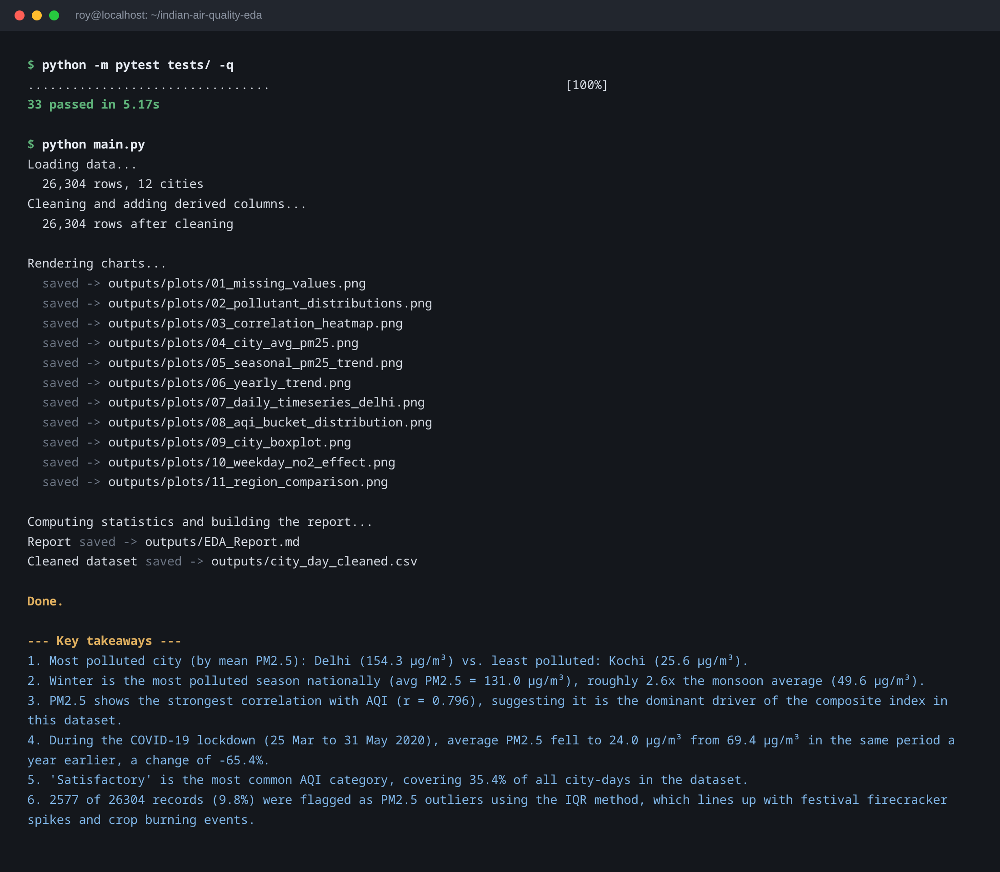
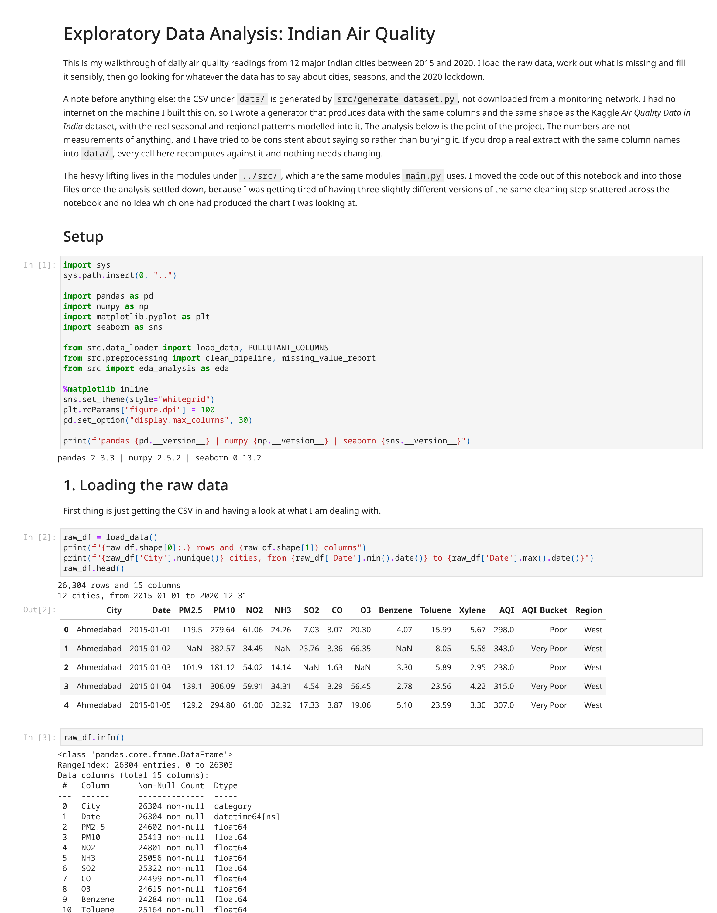
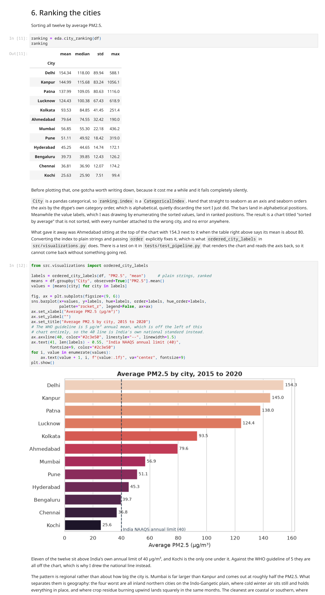
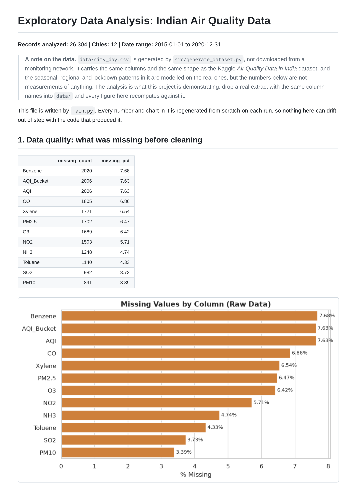

# Indian Air Quality analysis using Exploratory Data Analysis

A full EDA workflow in Python, taking daily air quality readings from 12 major Indian cities between 2015 and 2020 from a raw messy CSV through to a written report with charts and conclusions. The cities are Delhi, Mumbai, Kolkata, Chennai, Bengaluru, Hyderabad, Ahmedabad, Pune, Lucknow, Patna, Kanpur and Kochi.

I started this in Jupyter Lab as one long notebook, then pulled the code out into proper modules under `src/` once the analysis settled down, mostly because I had ended up with three slightly different versions of the same cleaning step scattered through the notebook and no idea which one had produced the chart I was looking at. The notebook is still the best way to read the analysis. The modules are what make it reproducible.

```bash
git clone https://github.com/YOUR-USERNAME/indian-air-quality-eda.git
cd indian-air-quality-eda
pip install -r requirements.txt
python main.py
```

That regenerates every chart and rewrites the report from scratch in about twenty seconds.

## A note on the data, up front

`data/city_day.csv` is generated by `src/generate_dataset.py`. It is not downloaded from a monitoring network, and the numbers in it are not measurements of anything.

I had no internet access on the machine I built this on, so rather than working with nothing I wrote a generator that produces data with the same columns and the same shape as the Kaggle [Air Quality Data in India](https://www.kaggle.com/datasets/rohanrao/air-quality-data-in-india) dataset, with the real structure modelled into it: winter smog in the northern cities, flatter coastal cities, a weekday traffic signal in NO2, sensor outages that come in multi-week runs and not just single days, and the 2020 lockdown drop.

The analysis is the point of this project rather than the numbers, and I would rather say that clearly at the top than have someone find it out three sections in. If you drop a real extract with the same column names into `data/city_day.csv`, everything here recomputes against it and no code needs to change.

## What the analysis found


Eleven of the twelve cities sit above India's own annual limit of 40 µg/m³. The split is regional rather than about city size: Mumbai is far bigger than Kanpur and comes out at roughly half the PM2.5. What separates them is geography, since the four worst are all inland northern cities where cold winter air sits still, and the cleanest are coastal or southern where there is wind to move it along.


This is the chart that says something the bar chart cannot. The northern cities are not just worse on average, their boxes are dramatically taller. Delhi's interquartile range alone is wider than Kochi's entire distribution. The difference between these places is in the bad days and how far the bad days go, not a fixed offset you could subtract away.


Five winter peaks in a row, then the lockdown window where the line drops to a level it does not otherwise reach anywhere in six years.

The main conclusions, in short:

- **Season matters more than city.** Winter runs at roughly 2.6 times the monsoon average nationally, which is a bigger swing than the gap between the most and least polluted city. Any comparison between two cities that does not control for month is largely measuring which months were in the sample.
- **PM2.5 leads the AQI** at r = 0.80, ahead of every other pollutant. Worth caveating, and section 5 of the notebook does: the AQI here is derived from PM2.5 by the generator, so some of that is built in.
- **The lockdown period shows a 65% drop** against the same calendar weeks of 2019. The comparison is deliberately year on year rather than against the weeks just before lockdown, since March to May is already falling away from the winter peak and a before-and-after inside 2020 would credit the lockdown with a seasonal decline that was coming anyway.
- **NO2 drops about 14% at weekends,** consistently across all seven days rather than one odd Sunday, which is the traffic signal showing through.
- **Just under 10% of readings get flagged as outliers,** and that turned out to be the most interesting result rather than a data quality problem. See below.

### The outlier result changed how I did the rest

I went in expecting the IQR test to find broken sensors. What it actually found was the northern winter. The flagged days cluster in December, January and February, and in Delhi, Kanpur, Patna and Lucknow, which is precisely where the analysis says the severe pollution genuinely is.

So they are flagged in a column and never dropped. Deleting them would have removed exactly the days that matter most and left a dataset that looks tidier while describing a country with a considerably better air quality problem than the real one. On a right skewed seasonal variable, "statistically unusual" and "wrong" are not the same claim, and reaching for the standard rule without looking at what it caught would have quietly thrown away the most important part of the data.

## What it looks like when you run it

`python main.py` runs the tests, the cleaning, all eleven charts and the report:



The notebook is the readable version, with the reasoning written alongside each step:





And `outputs/EDA_Report.md` is written out on every run, so the tables and charts in it can never drift away from the code that produced them:



## Two bugs worth writing down

Both of these produced a wrong result with no error, no warning and no obviously broken output, which is the kind I find hardest to catch.

**Interpolating across cities instead of within them.** Filling missing readings with `df.interpolate()` over the whole table means the rows either side of a gap can belong to a different city, so a missing Delhi reading in January gets filled from Chennai in July. It runs clean and leaves no NaNs. What gave it away was Kochi growing a January spike it has no reason to have. `interpolate_by_city` now works one city at a time, and `test_interpolation_does_not_leak_between_cities` fails if anyone undoes it.

**Seaborn silently reordering a categorical axis.** `City` is a pandas categorical, so a sorted ranking still carries a `CategoricalIndex`, and seaborn orders the axis by the dtype's category order, which is alphabetical. The bars land alphabetically while the value labels, drawn by enumerating the sorted values, land in ranked order. You get a chart titled "sorted by average" that is not sorted, with every number attached to the wrong city. I caught it because Ahmedabad was sitting at the top of the chart with 154.3 next to it when the table above said its mean was about 80. `ordered_city_labels` converts to plain strings, and there is a test that renders the chart and reads the axis back.

There was a third, smaller one: `src/visualizations.py` used to call `matplotlib.use("Agg")` unconditionally at import. Fine from a script, quietly destructive in a notebook, where importing it for one helper swapped out the inline backend and every `plt.show()` after that point rendered nothing at all. It now only switches when the current backend is not a notebook one.

## Running it

### Google Colab

Open `notebooks/Colab_Quickstart.ipynb` in Colab. It clones the repo, installs what Colab is missing, runs the tests, runs the pipeline and displays every chart and the report inline. Put your GitHub username in the first cell and run all. Full instructions including how to get the notebook into Colab are in [GUIDE.md](GUIDE.md).

### Local Jupyter Lab

```bash
python -m venv venv
source venv/bin/activate          # Windows: venv\Scripts\activate
pip install -r requirements.txt
jupyter lab
```

Then open `notebooks/EDA_Indian_Air_Quality.ipynb` and run it top to bottom.

### Just the script

```bash
python main.py
```

No notebook needed. It generates the dataset if it is missing, cleans it, writes all eleven charts into `outputs/plots/`, and writes `outputs/EDA_Report.md` and `outputs/city_day_cleaned.csv`.

### Tests

```bash
pytest -v
```

33 tests covering the loading, the cleaning, the analysis functions and the charts. The ones that earn their keep are the interpolation tests and the chart ordering test, since those cover the two failures above that produced no error on their own.

## Project layout

```
indian-air-quality-eda/
├── data/
│   └── city_day.csv                    generated dataset, 26,304 rows
├── src/
│   ├── generate_dataset.py             builds the synthetic dataset
│   ├── data_loader.py                  reads the CSV, fixes dtypes
│   ├── preprocessing.py                cleaning, interpolation, features
│   ├── eda_analysis.py                 stats, rankings, correlations, insights
│   └── visualizations.py               every chart function
├── notebooks/
│   ├── EDA_Indian_Air_Quality.ipynb    the walkthrough, outputs included
│   └── Colab_Quickstart.ipynb          one-click version for Colab
├── tests/
│   └── test_pipeline.py                33 tests
├── outputs/
│   ├── plots/                          11 charts
│   └── EDA_Report.md                   generated report
├── archive/                             regenerable files, kept out of git
├── screenshots/                         images used in this README
├── main.py                              run everything end to end
├── GUIDE.md                             Colab and GitHub setup steps
└── requirements.txt
```

Two things about what is and is not committed here.

The notebook in `notebooks/` is committed **with** its outputs, so GitHub renders every chart without you having to run anything. Same reasoning for `outputs/plots/` and `outputs/EDA_Report.md`: the README and the report have readers who will never clone this repo, so those images have to be in it.

The cleaned dataset is **not** committed, because it has no such reader. `main.py` writes it to `outputs/city_day_cleaned.csv` on every run, and anyone who wants it is already running the pipeline. See [archive/README.md](archive/README.md).

## What I would do next

Compare each day against its own city and its own month so the outlier flag finds genuine anomalies instead of rediscovering winter. Pull in weather data, since a good part of what looks like a seasonal emissions pattern is really wind and temperature. Swap in a real CPCB extract and see how much of this survives contact with actual measurements, which is the honest test of all of it. And if the analysis holds up, a small Streamlit app so someone can filter by city and date range instead of reading a static report.

## Built with

Python, pandas, numpy, matplotlib, seaborn, pytest and Jupyter. It all runs on a free Colab instance if you would rather not set anything up locally.
