# Exploratory Data Analysis: Indian Air Quality Data

**Records analyzed:** 26,304  |  **Cities:** 12  |  **Date range:** 2015-01-01 to 2020-12-31

> **A note on the data.** `data/city_day.csv` is generated by `src/generate_dataset.py`, not downloaded from a monitoring network. It carries the same columns and the same shape as the Kaggle *Air Quality Data in India* dataset, and the seasonal, regional and lockdown patterns in it are modelled on the real ones, but the numbers below are not measurements of anything. The analysis is what this project is demonstrating; drop a real extract with the same column names into `data/` and every figure here recomputes against it.

This file is written by `main.py`. Every number and chart in it is regenerated from scratch on each run, so nothing here can drift out of step with the code that produced it.

## 1. Data quality: what was missing before cleaning

|            |   missing_count |   missing_pct |
|:-----------|----------------:|--------------:|
| Benzene    |            2020 |          7.68 |
| AQI_Bucket |            2006 |          7.63 |
| AQI        |            2006 |          7.63 |
| CO         |            1805 |          6.86 |
| Xylene     |            1721 |          6.54 |
| PM2.5      |            1702 |          6.47 |
| O3         |            1689 |          6.42 |
| NO2        |            1503 |          5.71 |
| NH3        |            1248 |          4.74 |
| Toluene    |            1140 |          4.33 |
| SO2        |             982 |          3.73 |
| PM10       |             891 |          3.39 |

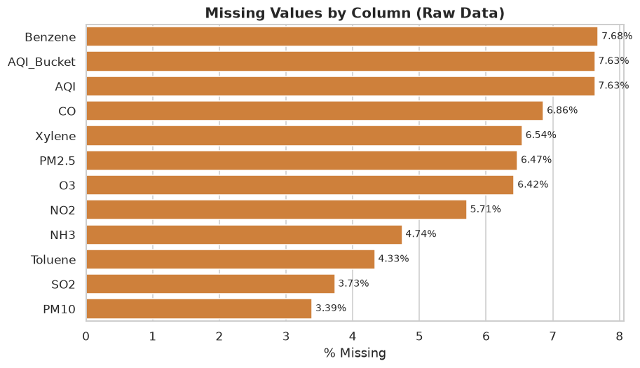

Every pollutant column has gaps in it, running from roughly 2% up to 8%. That is normal for this kind of data. Monitoring stations lose power, go down for maintenance, or fail validation checks, and the reading for that day simply never arrives.

The gaps are filled by `interpolate_by_city` in `src/preprocessing.py`, which interpolates against the date index one city at a time. Doing it per city is the part that matters: interpolating across the whole table at once would let a missing Delhi winter reading be filled with something shaped by Chennai's summer, which would be meaningless.

## 2. Descriptive statistics after cleaning

|         |   count |   mean |    std |   min |   25% |    50% |    75% |     max |
|:--------|--------:|-------:|-------:|------:|------:|-------:|-------:|--------:|
| PM2.5   |   26304 |  82.53 |  67.36 |  4.2  | 38.5  |  59.4  |  98    | 1116    |
| PM10    |   26304 | 155.47 | 129.65 |  6.15 | 71.4  | 113.85 | 189.99 | 1096.13 |
| NO2     |   26304 |  32    |  27.8  |  0.32 | 14.06 |  23.25 |  39.11 |  253.34 |
| NH3     |   26304 |  18.27 |  16.28 |  0    |  7.76 |  13.12 |  22.69 |  150.19 |
| SO2     |   26304 |  10.96 |  10.11 |  0    |  4.49 |   7.79 |  13.5  |   96.67 |
| CO      |   26304 |   1.64 |   1.47 |  0    |  0.7  |   1.17 |   2.02 |   13.38 |
| O3      |   26304 |  27.38 |  26.23 |  0    | 10.84 |  19.2  |  33.95 |  257.15 |
| Benzene |   26304 |   2.73 |   2.68 |  0    |  1.04 |   1.91 |   3.38 |   26.6  |
| Toluene |   26304 |   8.23 |   8.04 |  0    |  3.09 |   5.78 |  10.2  |   78.32 |
| Xylene  |   26304 |   1.84 |   1.88 |  0    |  0.66 |   1.26 |   2.28 |   18.22 |
| AQI     |   26304 | 166.05 | 130.26 |  7    | 66    | 106    | 262    |  500    |

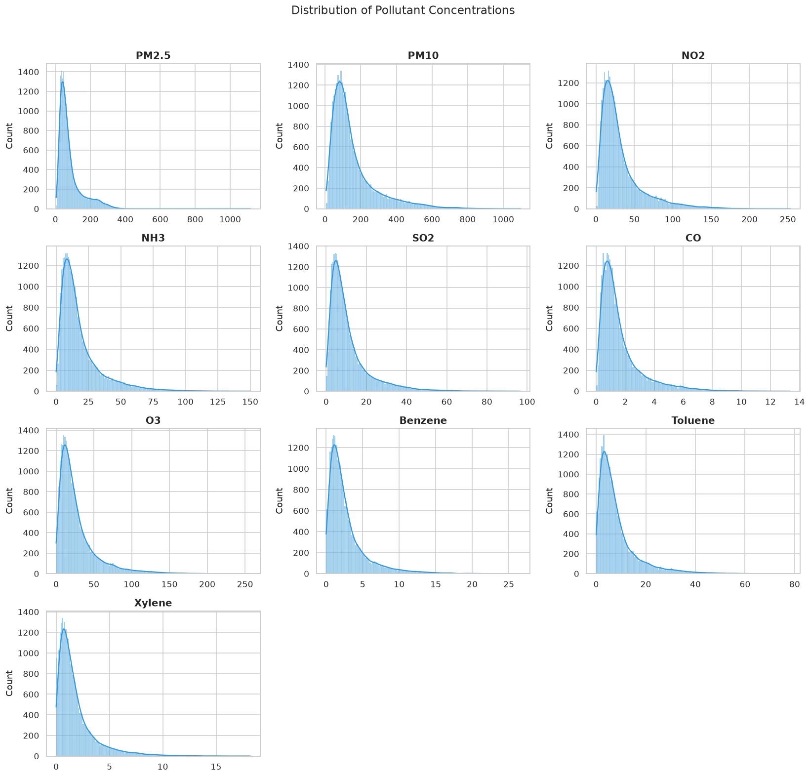

Every pollutant is right skewed, with the mean sitting well above the median. That is the signature of a variable where most days are unremarkable and a handful are severe, and it is the reason the city ranking below reports the median alongside the mean.

## 3. How each pollutant tracks the AQI

|         |   correlation_with_AQI |
|:--------|-----------------------:|
| PM2.5   |                  0.796 |
| PM10    |                  0.763 |
| NO2     |                  0.732 |
| CO      |                  0.711 |
| NH3     |                  0.71  |
| SO2     |                  0.686 |
| O3      |                  0.662 |
| Toluene |                  0.645 |
| Benzene |                  0.645 |
| Xylene  |                  0.618 |

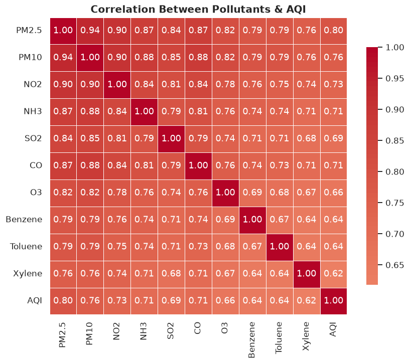

PM2.5 leads at r = 0.796. All the pollutants correlate positively with each other, which makes sense given they largely share sources and share the weather that either disperses or traps them.

## 4. City ranking by mean PM2.5

| City      |   mean |   median |   std |    max |
|:----------|-------:|---------:|------:|-------:|
| Delhi     | 154.34 |   118    | 89.94 |  588.1 |
| Kanpur    | 144.99 |   115.68 | 83.24 | 1056.1 |
| Patna     | 137.99 |   109.05 | 80.63 | 1116   |
| Lucknow   | 124.43 |   100.38 | 67.43 |  618.9 |
| Kolkata   |  93.53 |    84.85 | 41.45 |  251.4 |
| Ahmedabad |  79.64 |    74.55 | 32.42 |  190   |
| Mumbai    |  56.85 |    55.3  | 22.18 |  436.2 |
| Pune      |  51.11 |    49.92 | 18.42 |  319   |
| Hyderabad |  45.25 |    44.65 | 14.74 |  172.1 |
| Bengaluru |  39.73 |    39.85 | 12.43 |  126.2 |
| Chennai   |  36.81 |    36.9  | 12.07 |  174.2 |
| Kochi     |  25.63 |    25.9  |  7.51 |   99.4 |

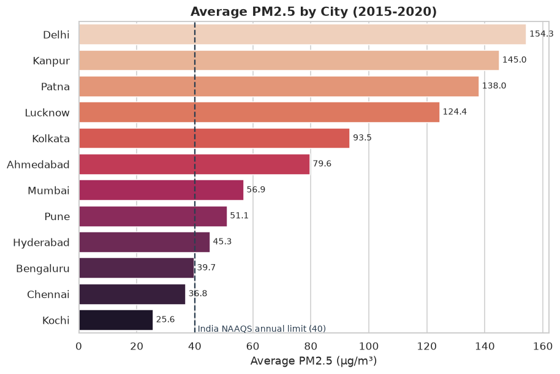

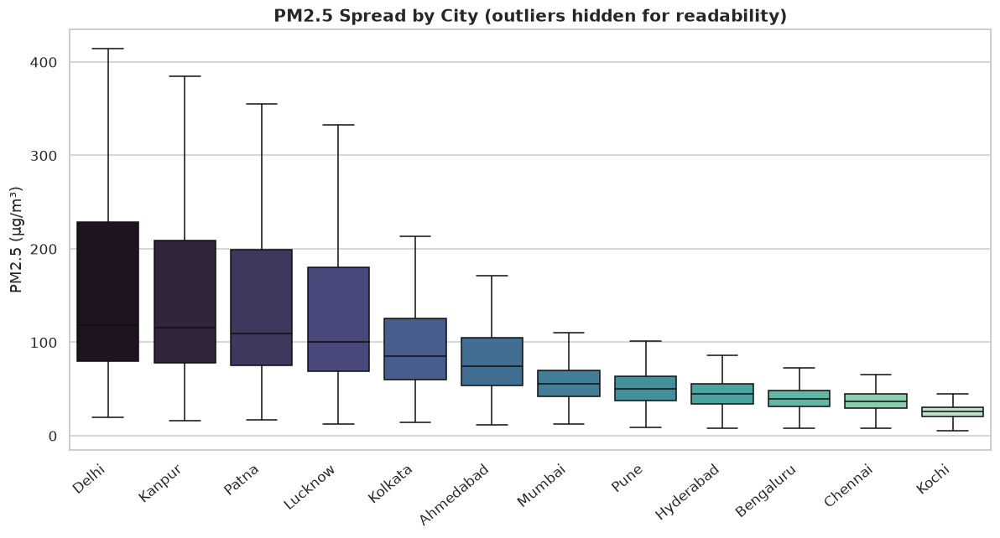

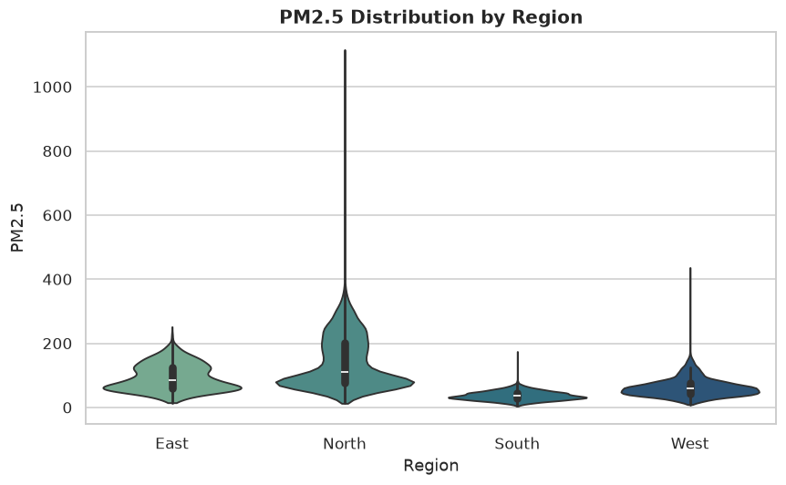

The split is regional rather than about city size. The four worst are all inland north Indian cities, and the cleanest are coastal or southern. Note the standard deviation column: the northern cities are not merely worse on average, they swing far harder between their good days and their bad ones.

## 5. Seasonal and yearly trends

### Average PM2.5 by season

| Season       |   avg_PM2.5 |
|:-------------|------------:|
| Winter       |       131   |
| Post-Monsoon |        89.2 |
| Summer       |        74.3 |
| Monsoon      |        49.6 |

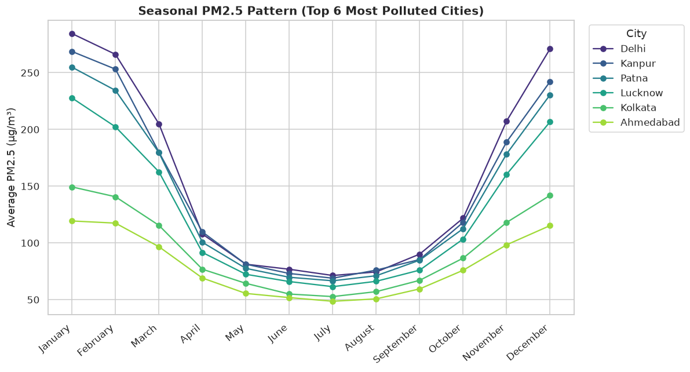

### Average PM2.5 by year

|   Year |   avg_PM2.5 |
|-------:|------------:|
|   2015 |        86.2 |
|   2016 |        85.9 |
|   2017 |        84   |
|   2018 |        84.4 |
|   2019 |        83.7 |
|   2020 |        70.9 |

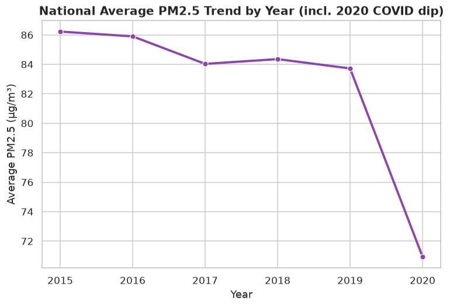

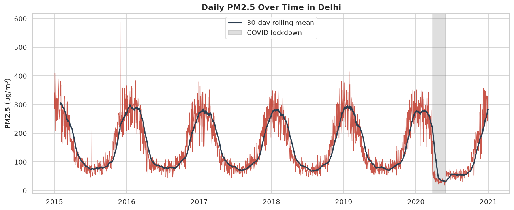

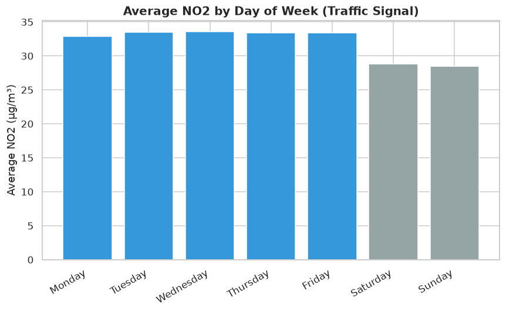

Season dominates. Winter runs at roughly 2.6x the monsoon average, a bigger swing than the gap between the best and worst cities. The weekday chart is a much smaller effect, but the weekend dip in NO2 is visible and consistent, which is what you would expect from a pollutant driven by commuter traffic.

## 6. AQI category breakdown

| AQI_Bucket   |   % of days |
|:-------------|------------:|
| Satisfactory |        35.4 |
| Moderate     |        20.3 |
| Very Poor    |        14.9 |
| Good         |        13.6 |
| Poor         |         8.7 |
| Severe       |         7.2 |

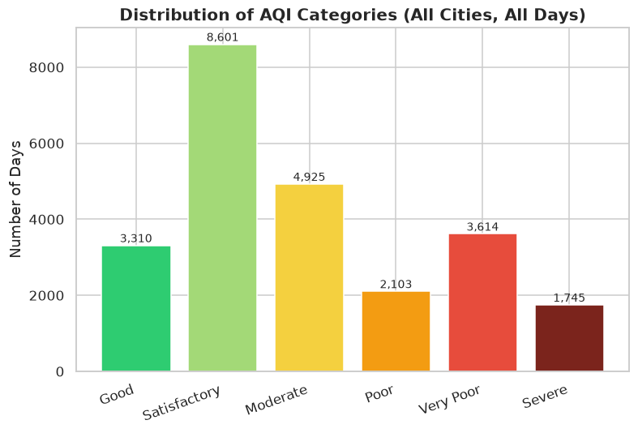

## 7. The COVID-19 lockdown, March to May 2020

- Same weeks in 2019, average PM2.5: **69.4 µg/m³**
- Lockdown period 2020, average PM2.5: **24.0 µg/m³**
- Change: **-65.4%**

The comparison is against the same calendar weeks of the previous year rather than against the weeks immediately before lockdown. March to May is already falling away from the winter peak, so a before-and-after comparison inside 2020 would hand the lockdown credit for a seasonal decline that was coming regardless.

## 8. Outliers

- Total records: 26,304
- Flagged as PM2.5 outliers (IQR, k = 1.5): 2,577 (9.8%)

These are flagged and kept, never dropped. On a right skewed seasonal variable the IQR test flags the entire northern winter, and those are the days the analysis most needs to keep. The flag is a column you can filter on, not a deletion.

## 9. Key takeaways

1. Most polluted city (by mean PM2.5): Delhi (154.3 µg/m³) vs. least polluted: Kochi (25.6 µg/m³).
2. Winter is the most polluted season nationally (avg PM2.5 = 131.0 µg/m³), roughly 2.6x the monsoon average (49.6 µg/m³).
3. PM2.5 shows the strongest correlation with AQI (r = 0.796), suggesting it is the dominant driver of the composite index in this dataset.
4. During the COVID-19 lockdown (25 Mar to 31 May 2020), average PM2.5 fell to 24.0 µg/m³ from 69.4 µg/m³ in the same period a year earlier, a change of -65.4%.
5. 'Satisfactory' is the most common AQI category, covering 35.4% of all city-days in the dataset.
6. 2577 of 26304 records (9.8%) were flagged as PM2.5 outliers using the IQR method, which lines up with festival firecracker spikes and crop burning events.
